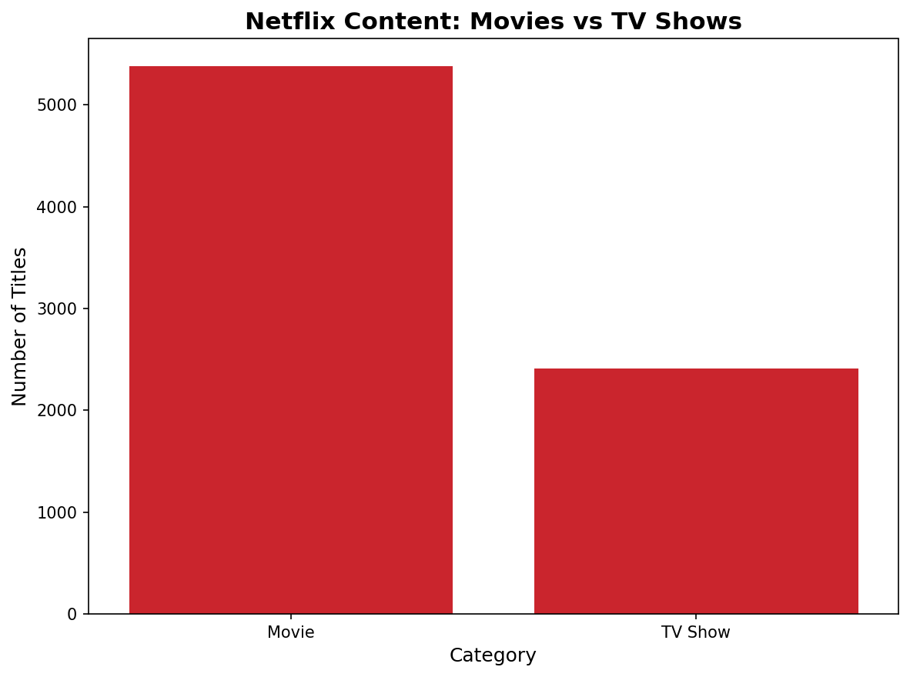
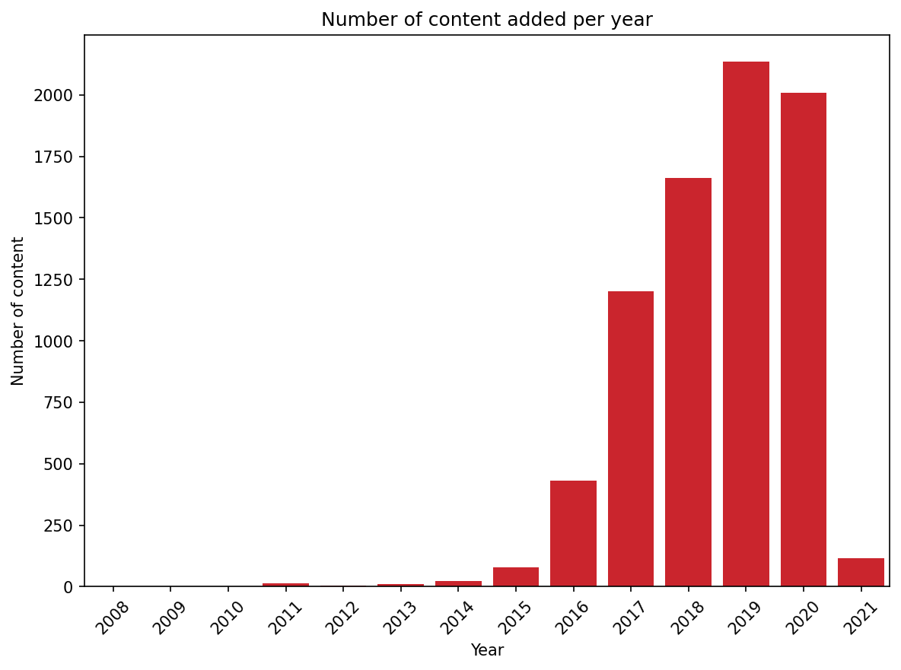
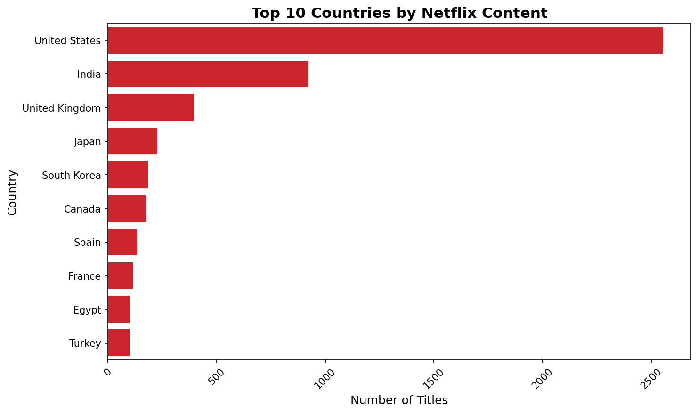
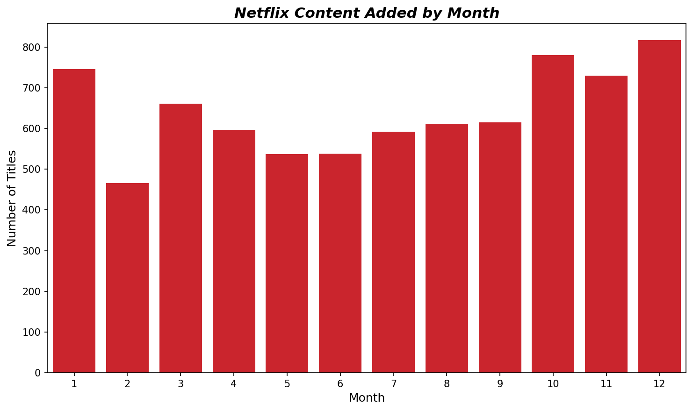
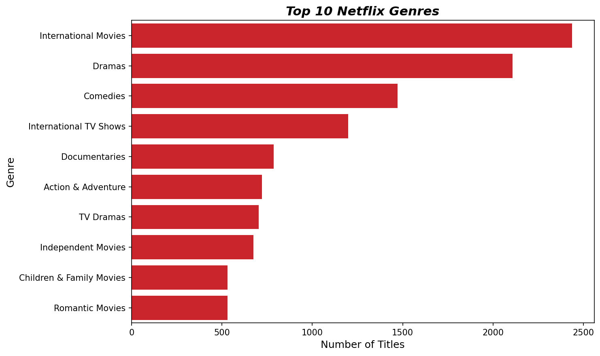

# 🎬 Netflix Content Analysis


An exploratory data analysis (EDA) of Netflix's content library, uncovering patterns
in content strategy, growth trends, audience targeting, and global production.

---

## 📁 Project Structure

```
Netflix-Content-Analysis/
│
├── data/
│   └── Netflix Dataset.csv
│
├── charts/
│   ├── chart1_category_split.png
│   ├── chart2_content_per_year.png
│   ├── chart3_top_countries.png
│   ├── chart4_content_by_month.png
│   ├── chart5_top_genres.png
│   └── chart6_ratings.png
│
├── netflix_analysis.ipynb
└── README.md
```

---

## 📊 Dataset Overview

| Property | Value |
|----------|-------|
| Source | Netflix Movies and TV Shows |
| Total Titles | 7,789 |
| Columns | 11 |
| Time Period | 2016 – 2020 |
| Missing Values | Director (2,388), Cast (718), Country (507) |

**Columns:** `show_id`, `category`, `title`, `director`, `cast`, `country`,
`release_date`, `rating`, `duration`, `type`, `description`

---

## 🛠️ Tools & Libraries

- **Python 3.13**
- **Pandas** — data cleaning, manipulation, EDA
- **NumPy** — numerical operations
- **Matplotlib** — base visualizations
- **Seaborn** — statistical charts

---

## 🔄 Project Workflow

```
Data Loading → Inspection → Cleaning → EDA → Visualization → Insights
```

### Data Cleaning Steps
- Standardized column names to `snake_case`
- Converted `release_date` from string to `datetime64`
- Extracted `year_added` and `month_added` as nullable integers (`Int64`)
- Filled missing values in `director`, `cast`, `country` with `'unknown'`
- Parsed `duration` column to extract numeric minutes for movies

---

## 📈 Key Findings

### 1. Movies vs TV Shows


**Finding:** Netflix library is 69% movies (5,379 titles) vs 31% TV Shows (2,410 titles).  
**Business implication:** Netflix prioritizes movie content, suggesting higher investment
in film licensing and production over long-form series.

---

### 2. Content Added Per Year


**Finding:** Content grew 5x from 432 titles in 2016 to 2,137 in 2019,
then slightly declined to 2,009 in 2020.  
**Business implication:** Netflix aggressively expanded its library between 2016–2019,
but COVID-19 disrupted production schedules and acquisitions in 2020.

---

### 3. Top 10 Countries by Content


**Finding:** The United States leads with 2,556 titles, nearly 3x more than
India in second place (923). South Korea and Japan reflect Netflix's growing
investment in Asian content.  
**Business implication:** Netflix is a US-dominated platform but actively expanding
into Asian and Middle Eastern markets, signaling a global content diversification strategy.

---

### 4. Content Added by Month


**Finding:** December (817), October (780) and January (746) are the peak months
for new content. February is the lowest with 466 titles.  
**Business implication:** Netflix strategically releases most content during Q4 holiday
season to retain subscribers and attract new ones, with January catching post-holiday sign-ups.

---

### 5. Top 10 Genres


**Finding:** International Movies (2,427) and Dramas (2,107) are the top two genres.
Children & Family Movies rank near the bottom with only 513 titles.  
**Business implication:** Netflix targets a global adult audience, heavily investing
in drama and international content while under-serving the family and children's market.

---

### 6. Ratings Distribution


**Finding:** TV-MA dominates with 2,865 titles (~37% of all content),
followed by TV-14 with 1,931 titles. Children's ratings (TV-Y, TV-Y7, G)
combined make up less than 10%.  
**Business implication:** Netflix is an adult-first platform. Brands or creators
targeting children and family audiences would find limited placement opportunities on Netflix.

---

## 🧠 Summary & Conclusions

| Finding | Insight |
|---------|---------|
| 69% Movies vs 31% TV Shows | Netflix is a movie-first platform |
| 5x growth from 2016–2019 | Aggressive content expansion phase |
| US leads with 2,556 titles | US-dominated but globally diversifying |
| Q4 peak releases | Holiday season content strategy |
| International Movies #1 genre | Global audience targeting |
| TV-MA dominates ratings | Adult-first content platform |

### Overall Takeaway
Netflix's data reveals a platform built for **global adult audiences** — heavily
weighted toward movies, mature content, and international productions. Its explosive
2016–2019 growth was a deliberate content arms race, slightly disrupted by COVID-19
in 2020. The platform's release calendar is strategically timed around holiday seasons
to maximize subscriber retention.

---

## 🚀 How to Run

1. Clone the repository
```bash
git clone https://github.com/your-username/netflix-content-analysis.git
cd netflix-content-analysis
```

2. Install dependencies
```bash
pip install pandas numpy matplotlib seaborn jupyter
```

3. Launch the notebook
```bash
jupyter notebook netflix_analysis.ipynb
```

---

## 👤 Author

**Muhammad Roman Khan (Romeo)**  
Aspiring Data Analyst | Python • SQL • Data Visualization  
📍 Pakistan

---

## 📌 Note
This project was built as part of a hands-on data analysis learning journey,
applying real-world EDA techniques on a public dataset.
